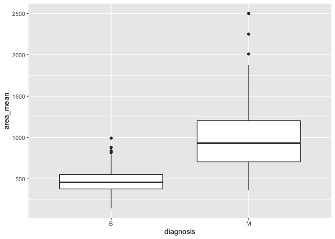
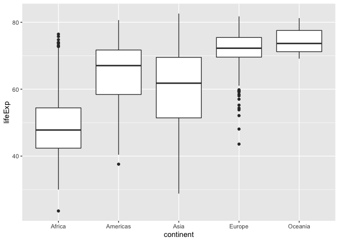

<!-- README.md is generated from README.Rmd. Please edit that file -->

# quick.boxplot

<!-- badges: start -->
<!-- badges: end -->

The goal of quick.boxplot is to create boxplots from inputted datasets,
as well as categorical (x) and continuous (y) variables in ggplot2.

## Installation

quick_boxplot is not availabe on CRAN, but you can download with:

``` r
install.packages("quick.boxplot")
```

And the development version from [GitHub](https://github.com/) with:

You can install this package with:

``` r
# install.packages("devtools")
devtools::install_github("mchester/assignment_b2")
```

## Example

This is a basic example which shows you how to solve a common problem:

``` r
library(quick.boxplot)
quick_boxplot(datateachr::cancer_sample, diagnosis, area_mean)
```



``` r
quick_boxplot(gapminder:: gapminder, continent, lifeExp)
```



This package is special because it saves you from repeating code in the
visualization of the difference of means between categorical and
continuous variables.
